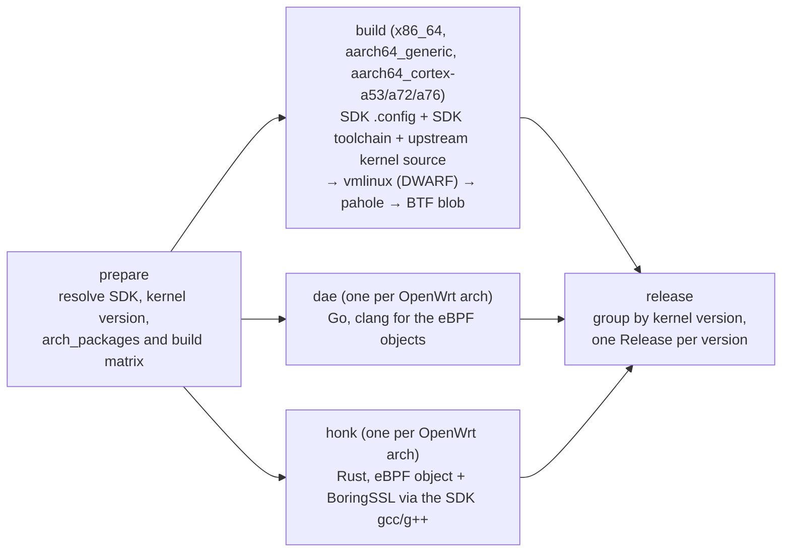

# vmlinux-bpf-build

Builds a BTF-enabled `vmlinux` for OpenWrt targets and cross-compiles two
daeuniverse userspace binaries, then publishes everything in a single GitHub
Release per kernel version.

The kernel build reproduces what the OpenWrt package
[QiuSimons/vmlinux-btf](https://github.com/QiuSimons/vmlinux-btf) does — a
"shadow kernel" built from upstream sources with the target's own `.config` and
the BTF/BPF option set turned on — but it takes the baseline `.config`, the
kernel version and the compiler from the **official OpenWrt SDK** of each
target, so a full OpenWrt buildroot (and a toolchain build) is not needed.

Everything happens in a single workflow,
[`.github/workflows/build-vmlinux-btf.yml`](.github/workflows/build-vmlinux-btf.yml),
which is documented below. See [Provenance](#provenance) for where each part
comes from.

---

## What it produces

| Asset | Contents | Built from |
|---|---|---|
| `<openwrt_version>-vmlinux-<openwrt_arch>-<kernel_version>.tar.xz` | one file named `vmlinux`: the detached BTF blob (default) or the full ELF with `artifact: vmlinux` | upstream kernel source + the SDK's kernel `.config`, compiled by the SDK toolchain |
| `<openwrt_version>-dae-nightly-<openwrt_arch>-<date>.tar.xz` | `dae`, `LICENSE`, `README.md` | [daeuniverse/dae](https://github.com/daeuniverse/dae) |
| `<openwrt_version>-honk-debug-<openwrt_arch>-<date>.tar.xz` | `honk-core`, `LICENSE`, `README.md` | [daeuniverse/honk](https://github.com/daeuniverse/honk) |

Every archive is uploaded together with its `.sha256` checksum. The userspace
binaries are built once per OpenWrt architecture; since they do not depend on
the kernel version, their name carries the release tag upstream uses for them
(`nightly` for dae, `debug` for honk) and the build date instead of it, so
`x86_64` gets `25.12.5-dae-nightly-x86_64-2026-09-25.tar.xz` while
`aarch64_cortex-a76` gets
`25.12.5-honk-debug-aarch64_cortex-a76-2026-09-25.tar.xz`.

`<date>` is `date -I` of the build day, resolved once in the prepare job with
`TZ=Asia/Shanghai` (the day boundary dae uses for its own nightly build, so an
evening UTC run is not labelled with yesterday), and the same
`nightly-<date>` / `debug-<date>` string is the version the binaries report:
dae is passed `VERSION=nightly-<date>`, and honk derives `HONK_VERSION` from
`GITHUB_REF`, so a `refs/tags/debug-<date>` ref is exported for its build (the
workflow then asserts that the tag, not the git fallback, is what ended up in
the binary).

## Usage

1. Go to **Actions → Build vmlinux (BTF) → Run workflow**.
2. Fill in the inputs:

| Input | Default | Meaning |
|---|---|---|
| `openwrt_version` | `25.12.5` | OpenWrt release to build for, e.g. `25.12.5` or `24.10.8`. The kernel version is taken from that release, not entered by hand. |
| `artifact` | `btf` | `btf` packages the detached BTF blob (a few MB, what the upstream package installs). `vmlinux` packages the compiled ELF including DWARF debug info and the embedded BTF, which is much larger. |

3. The result appears under **Releases**, tagged
   `openwrt-<openwrt_version>-<kernel_version>` — for example
   `openwrt-25.12.5-6.12.94`. All architectures of one kernel version are
   collected in that single release; re-running the workflow overwrites the
   existing assets instead of failing, and an existing tag/release is reused.
   The `dae`/`honk` assets are kernel independent, so every release published by
   a run carries the same set of them (all five architectures).

On a device, the BTF blob is normally installed where libbpf and `bpftool`
expect it, `/usr/lib/debug/boot/vmlinux` (the symlink next to it is what the
upstream package creates), while `dae` and `honk-core` go to `/usr/bin`.

## Architectures

One representative target/subtarget per OpenWrt architecture (`arch_packages`):

| OpenWrt arch | target/subtarget | kernel arch |
|---|---|---|
| `x86_64` | `x86/64` | x86_64 |
| `aarch64_generic` | `armsr/armv8` | arm64 |
| `aarch64_cortex-a53` | `mediatek/filogic` | arm64 |
| `aarch64_cortex-a72` | `bcm27xx/bcm2711` | arm64 |
| `aarch64_cortex-a76` | `bcm27xx/bcm2712` | arm64 |

Several targets share the same `arch_packages` (for `aarch64_cortex-a53` also
`qualcommax/ipq807x`, `sunxi/cortexa53`, `mvebu/cortexa53`, …), so the list picks
one each. If a device needs a different kernel `.config`, replace the row with
another target/subtarget that reports the same `arch_packages` — the workflow
verifies `arch_packages` against `profiles.json` and fails fast if it does not
match.

The userspace binaries are built for every row of that table, one job per
architecture, using the SDK of that architecture (the same matrix drives the
kernel and the userspace builds). `dae` is plain Go, so it only needs
`GOOS=linux` plus the right `GOARCH`/`GOAMD64`/`GOARM64`, and it is tuned per
architecture: `amd64` for `x86_64`, `arm64` with `GOARM64=v8.0` for the generic
and Cortex-A53/A72 targets, and `GOARM64=v8.2,lse` for `aarch64_cortex-a76`
(the A76 implements ARMv8.2 with LSE atomics, which lets Go emit atomic
instructions instead of LL/SC loops). `honk` uses the target's own OpenWrt
toolchain, so each architecture gets a binary built against its own musl and
instruction set.

## How it works

**prepare** — reads
`releases/<version>/targets/<target>/<subtarget>/profiles.json` for
`arch_packages` (validated) and `linux_kernel.version`, and finds the SDK archive
of each target in the download index.

**build** (one job per architecture, does not depend on the other jobs) —
downloads and extracts the SDK, then takes from it:

* the kernel `.config` of that target (`build_dir/*/linux-*/linux-*/.config`),
  far more accurate than a `defconfig`,
* the cross toolchain (`staging_dir/toolchain-*/bin/*-openwrt-linux-musl-gcc`),
  used as an absolute `CROSS_COMPILE` and put on `PATH`,
* `STAGING_DIR` / `STAGING_DIR_HOST`, which the OpenWrt toolchain needs to find
  its sysroot (the values follow OpenWrt's `rules.mk`).

It then downloads the matching upstream kernel source from kernel.org, applies
the option set of the reference Makefile with `scripts/config`, runs
`make olddefconfig`, verifies the required symbols (BPF, kprobes/uprobes,
`DEBUG_INFO`, `DEBUG_INFO_BTF`, …) while warning about optional ones such as
tracepoints, builds `vmlinux` with DWARF debug info and finally runs
`pahole --btf_encode_detached`.

**dae** — pure Go (`CGO_ENABLED=0`), so no target C compiler is involved at all.
The Go toolchain comes from `actions/setup-go` using the version in `dae/go.mod`,
clang compiles the eBPF objects that `bpf2go` embeds, the submodules holding the
eBPF headers are checked out with the sources, and the architecture specific
`GOARCH`/`GOAMD64`/`GOARM64` values are exported before `make` runs — the
Makefile unsets the cross-compile variables around `go generate` only, so the
host side still generates the eBPF objects on the runner (`GOARM64` needs Go
1.23 or newer; the version comes from `dae/go.mod`). The version it reports is
`nightly-<date>`, passed as `VERSION` to the Makefile in place of dae's own
`unstable-<git date>.r<count>.<commit>` default.

**honk** — Rust. The two pinned toolchains are read from the repository's
`rust-toolchain.toml` (stable, plus a nightly in `crates/honk-ebpf` for the eBPF
side), the pinned `bpf-linker` comes from its `.github/ci/pins.env`, and the eBPF
object is built once on the host because it is target independent. The C/C++
dependencies (BoringSSL through `boring-sys`, bundled SQLite) are compiled by the
**OpenWrt SDK** `gcc`/`g++`, and rustc links the result against the SDK's musl:
`-C link-self-contained=no` together with `-C target-feature=-crt-static`
(without the latter the musl Rust target defaults to `crt-static=true` and the
link fails, because the SDK ships no static unwind library). Only the Rust
`std` that rustup provides is prebuilt, everything else is compiled by the SDK
compiler. A final check rejects a GLIBC interpreter and a dependency on
`libsystemd` (OpenWrt has no systemd), and lists any other shared library it did
not expect. The version it reports is `debug-<date>`: honk's build script takes
`HONK_VERSION` from `GITHUB_REF` when that is a tag ref, so the step exports
`refs/tags/debug-<date>` and then asserts that string is really in the binary
(it cannot be executed on the runner, being a musl binary for the target).

**release** — collects the artifacts, groups the kernel assets by kernel version,
and for each group checks whether the tag/release already exists
(`gh release view` and `gh api .../git/ref/tags/...`) before creating it, then
uploads all assets with `--clobber`. The `dae`/`honk` assets are added to every
group, since they do not belong to one kernel version. Creating the tag is done
with `gh`, pointing it at the commit the workflow ran on.

## Provenance

Everything in this repository is derived from other projects; the table below
records where each piece comes from and what was taken from it.

| Source | Taken from it |
|---|---|
| [QiuSimons/vmlinux-btf](https://github.com/QiuSimons/vmlinux-btf) (OpenWrt package, GPL-3.0) | The whole approach: build a shadow kernel from the upstream source using the target's `$(LINUX_DIR)/.config`, turn on the BPF/BTF option set, `make vmlinux`, then `pahole --btf_encode_detached`. The `scripts/config` option list (`CGROUPS`, `CGROUP_BPF`, `KPROBES`, `UPROBES`, `BPF*`, `XDP_SOCKETS`, `NET_CLS*`, `DEBUG_INFO*`, `EXTRA_FIRMWARE`/`INITRAMFS_SOURCE` emptied, …) is copied from its `Makefile`. Two things are added by this workflow: `FTRACE`/`TRACING`, which gate `KPROBE_EVENTS`/`UPROBE_EVENTS`/`TRACEPOINTS` in `kernel/trace/Kconfig` and must be enabled explicitly when the target's `.config` had them off, and emptying `SYSTEM_TRUSTED_KEYS`/`SYSTEM_REVOCATION_KEYS` so that no certificate is needed in CI. Note that its README states it applies the same patches as the main kernel while the Makefile applies none — this workflow follows the implementation, i.e. it does not patch either. |
| [openwrt/openwrt](https://github.com/openwrt/openwrt) (GPL-2.0) | The prebuilt SDKs (toolchain, target kernel `.config`, `staging_dir` layout), the `STAGING_DIR` / `STAGING_DIR_HOST` semantics from `rules.mk`, and the target metadata (`profiles.json`: `arch_packages`, `linux_kernel.version`). |
| [torvalds/linux](https://github.com/torvalds/linux) / kernel.org (GPL-2.0) | The kernel sources, downloaded as release tarballs (`linux-<version>.tar.xz`, with a `git.kernel.org` fallback). Builds use `scripts/config`, `make olddefconfig` and `pahole` from the kernel tree plus the `dwarves` package. |
| [daeuniverse/dae](https://github.com/daeuniverse/dae) (AGPL-3.0) | The sources, built with its own `Makefile` and its `dae_bpf_headers` submodules. The cross-compile recipe (`CGO_ENABLED=0`, clang for `bpf2go`, `GOOS=linux`) follows its release workflow; the Makefile itself unsets `GOOS`/`GOARCH` around `go generate` so the eBPF generation runs on the host. Its rolling nightly build is where the `nightly` tag and the 20:00 UTC+8 day boundary of the version string come from. |
| [daeuniverse/honk](https://github.com/daeuniverse/honk) (GPL-3.0) | The sources and the build recipe from its release workflow: pinned toolchains from the `rust-toolchain.toml` files, the eBPF object built once with `-Zbuild-std=core --target bpfel-unknown-none` plus the BTF assertion, `bpf-linker` pinned through `.github/ci/pins.env`, the default feature set (`clash-api`, `mimalloc`, `rprx`, `ebpf`), the zig wrapper trick from `ci/zigcc`/`ci/zigcxx`/`ci/zig-bindgen-env` and the CMake/bindgen handling it exists for — re-implemented here against the OpenWrt `gcc`/`g++` instead of zig, because the SDK already provides a compiler for the target and its libc. Its rolling `debug` prerelease is where the `debug` tag naming comes from. |
| [aya-rs/bpf-linker](https://github.com/aya-rs/bpf-linker) | The prebuilt `bpf-linker` binary (version and SHA256 come from honk's `pins.env`). |
| GitHub Actions | `actions/checkout`, `actions/setup-go`, `actions/upload-artifact`, `actions/download-artifact`, `dtolnay/rust-toolchain`. |

The build job summaries record the upstream commit each userspace binary was
built from (the archives themselves carry the `nightly`/`debug` version string
with the build date, and the release notes repeat the asset naming scheme).

## Notes and limitations

* **BTF fidelity.** Because no OpenWrt patch is applied, the BTF describes
  upstream sources configured with the target's `.config`. If an OpenWrt patch
  changed a structure layout, CO-RE relocations against a device running that
  patched kernel can fail. This limitation is inherited from the reference
  implementation. Matching the device kernel *version* is the minimum; the
  `.config` is copied from the SDK precisely to keep the rest as close as
  possible.
* **One subtarget per architecture** is built (see above); the resulting `.config`
  is the one that subtarget uses.
* **`pahole` comes from the runner** (`dwarves` on Ubuntu 24.04). Kernels newer
  than what the runner's `dwarves` supports may need a newer one.
* **honk** is linked dynamically against the SDK's musl, so the device needs the
  standard C++ runtime: install `libstdcpp` (and libc, which every OpenWrt image
  has). The workflow fails if the binary asks for a GLIBC loader or for
  `libsystemd`. If the Rust LTO link ever trips the linker plugin of GNU `ld`,
  set `CARGO_PROFILE_RELEASE_LTO=false` for that build.
* **dae** is a static Go binary with no libc dependency at all, one build per
  architecture, version `nightly-<date>`.
* **honk** reports `debug-<date>`, the same tag/date pair that names its assets;
  both strings change with the build day even when the sources did not, so a
  re-run produces assets whose names differ (the tag/release they are attached
  to is still the kernel based `openwrt-<version>-<kernel_version>`).
* **Time and cost.** The five kernel builds take roughly 1–3 hours each and run
  in parallel, plus five dae and five honk jobs (the userspace jobs are much
  shorter). On plans with a low limit of concurrent jobs the runs will queue;
  trim the target list to what you need.
* **A failing userspace build does not block the release** — the kernel assets are
  published anyway and the missing `dae`/`honk` assets are simply absent from
  that release.

## Licensing

This repository contains the workflow and this README only; there is no
`LICENSE` file yet, and adding one is recommended.

The published artifacts redistribute third-party software, so the licenses of the
sources apply: the Linux kernel is GPL-2.0, `dae` is **AGPL-3.0** and `honk` is
GPL-3.0. The archives include each project's `LICENSE`/`README.md`, and the
release notes name the commit that was built, which is what
GPL/AGPL redistribution requires; keep that information with the binaries if you
mirror them elsewhere.
